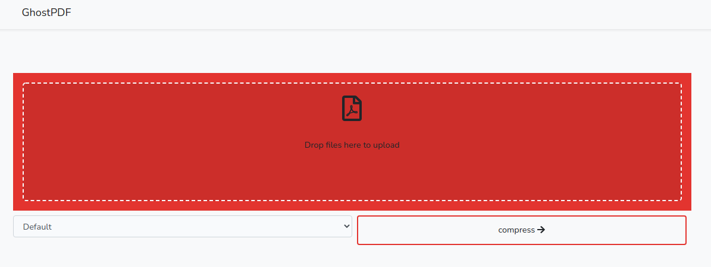

    <h1>GhostPDF</h1>

    
    
    
    

Simple laravel application to operate PDF files. 

The app is hosted on Heroku and it is available on [Heroku](http://ghostpdf.herokuapp.com). 

**HTTPS** is not available at the moment. Use http link

### App Preview

## Available Features

- **Compress PDF:** compress pdf without losing quality.
- **Cut PDF:** Remove pages from PDF
- **Secure PDF:** Add password to PDF
- **Convert PDF:** Create PDF file from XSLX or DOCX file

### Feature preview

Every feature has a drag-and-drop zone, a option box and a button. After the button is clicked the file is uploaded and then the app download the new file. 

Don't worry we don't save the file on our server :wink:

